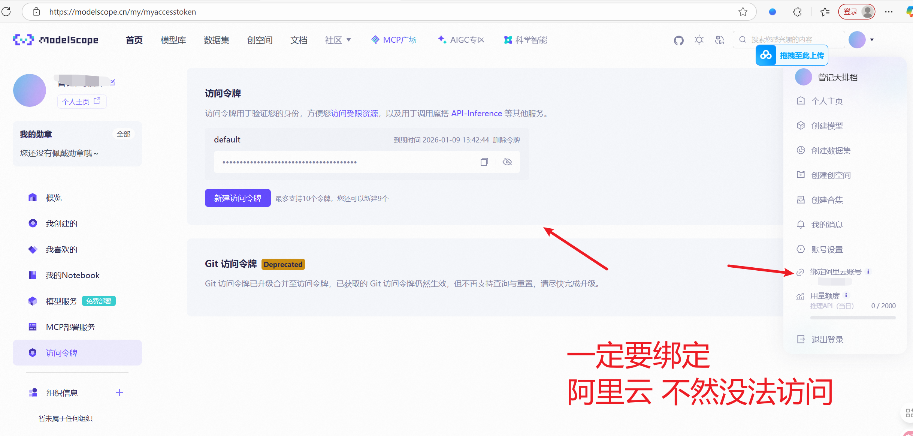
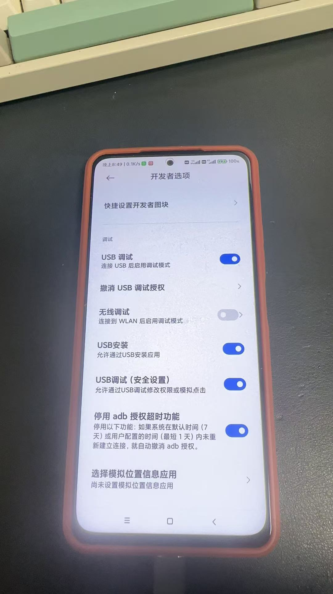
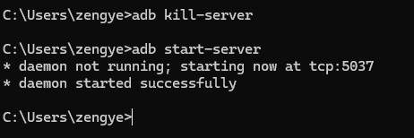

## 常见问题如下：
  + 耐心点 认真看视频教程

### 问题1 配置adb 设备链接 看教程 跟着教程走 保证可以成功配置
  + 耐心点 认真看视频教程

### 问题2 输入法没法输入
  + 一定要安装 `ADBKeyboard.apk` 有些手机没法通过ui界面安装 就自行把这个安装包发给手机（通过微信 qq都可以 文件传输助手都行） 手机上自行安装
  + 安装完成后需要设置输入法 点击启用

### 问题3 手机没法连接
  + 排查：usb线是否有问题 
  + 手机开发者模式一定要打开 （自行百度查看手机品牌如何打开开发者模式） 
  + 一般手机就是设置 =》关于手机 =》 点击版本号 连续点7-10下 （百度查看 自己的手机品牌如何打开开发者模式）
  + 开发者模式需要打开 usb调式模式也需要打开 （首次使用ui界面连接手机 手机上会弹窗提示 是否授权 需要点击是）

### 问题4：访问请求失败
  + 魔塔的api 魔塔的账号一定要绑定阿里云 不然apikey是无限的 会出现访问错误  https://modelscope.cn/
  + 

### 问题5 没法连接调式 显示没法安装键盘
  + 确保是否数据线问题
  + 有部分手机需要打开 两个usb调式模式 如图所示：
  + 打开后还需要重启下手机
  + 开发者选项下的 不锁定屏幕也启用下
  + 尽量插机箱后面的usb
  + 

### 问题6 还是不行就打开终端 win + r 执行cmd
  + 停止 `adb kill-server`
  + 执行 `adb start-server` 
  + 看手机是否有弹窗提示运行授权 点击是
  + 

### 部分手机问题
  + 小米手机需要插卡
  + 部分荣耀华为手机 需要 开发者选项 =》 选择usb配置 以太网
